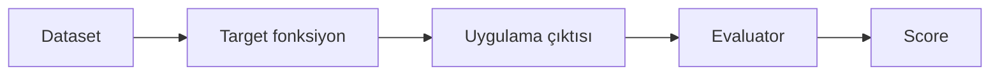

# evaluate() ile Toplu Değerlendirme

<span class="badge badge-orta">🟡 ORTA SEVİYE</span>

[Dataset](dataset-olusturma.md) hazır olduğunda, uygulamanızı bu dataset'in her örneği üzerinde çalıştırıp otomatik skorlamak için `evaluate()` kullanılır.

## Temel akış



## Target fonksiyon tanımlama

**Target fonksiyon**, dataset'in her bir örneğinin girdisini alıp uygulamanızın çıktısını döndüren fonksiyondur:

```python
def hedef_fonksiyon(inputs: dict) -> dict:
    cevap = musteri_botu.invoke({"messages": [("user", inputs["soru"])]})
    return {"cevap": cevap["messages"][-1].content}
```

## Evaluator tanımlama

**Evaluator**, hem dataset'in beklenen çıktısını (`inputs`, referans varsa) hem de uygulamanızın gerçek çıktısını (`outputs`) alıp bir skor döndüren fonksiyondur:

```python
def dogruluk_evaluator(inputs: dict, outputs: dict, reference_outputs: dict) -> bool:
    return reference_outputs["beklenen"].lower() in outputs["cevap"].lower()
```

## evaluate() çağrısı

```python
from langsmith import Client

client = Client()

sonuclar = client.evaluate(
    hedef_fonksiyon,
    data="musteri-sorulari-v1",
    evaluators=[dogruluk_evaluator],
    experiment_prefix="v2-deneme",
)
```

- **`data`**: dataset adı veya ID
- **`evaluators`**: bir veya daha fazla evaluator fonksiyonu
- **`experiment_prefix`**: bu çalıştırmayı tanımlayan isim — aynı dataset üzerinde farklı denemeleri (ör. `v1-deneme`, `v2-deneme`) ayırt etmenizi sağlar

!!! tip "evaluate() otomatik olarak trace'ler"
    `evaluate()`, target fonksiyonunuzu **otomatik olarak izler** — target fonksiyon içinde `@traceable` ile işaretlenmiş başka fonksiyonlar çağırırsanız, bunlar da child run olarak görünür. Bu trace'ler ana projenizin run listesinde değil, **dataset'in Examples → Linked Traces** kısmında görünür.

## Async değerlendirme

Target fonksiyonunuz asenkronsa, `evaluate()` yerine `aevaluate()` kullanılır — aynı parametreleri alır:

```python
from langsmith import Client

client = Client()

async def hedef_fonksiyon_async(inputs: dict) -> dict:
    cevap = await musteri_botu.ainvoke({"messages": [("user", inputs["soru"])]})
    return {"cevap": cevap["messages"][-1].content}

sonuclar = await client.aevaluate(
    hedef_fonksiyon_async,
    data="musteri-sorulari-v1",
    evaluators=[dogruluk_evaluator],
)
```

## Deneyleri karşılaştırma

Aynı dataset üzerinde farklı `experiment_prefix` ile birden fazla deney çalıştırdıktan sonra, UI'daki **Compare** görünümünde iki deneyi yan yana, örnek örnek karşılaştırabilirsiniz — hangi örneklerde regresyon olduğunu, hangilerinde iyileşme olduğunu tek bakışta görürsünüz.

---

Sıradaki adım: [LLM-as-judge Evaluator Yazma](llm-as-judge.md) — basit `bool`/eşitlik kontrolünün ötesine geçelim.
