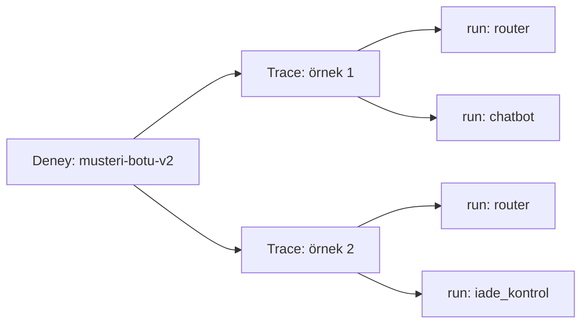

# LangGraph Grafını Değerlendirme

<span class="badge badge-ileri">🔴 İLERİ / SENIOR</span>

`evaluate()`'in target fonksiyonu, herhangi bir Python fonksiyonu olabilir — bu, derlenmiş bir LangGraph `app`'i doğrudan değerlendirebileceğiniz anlamına gelir.

## Derlenmiş grafı doğrudan hedef fonksiyon yapmak

```python
from langsmith import Client

client = Client()

def hedef_fonksiyon(inputs: dict) -> dict:
    config = {"configurable": {"thread_id": f"eval-{inputs['soru'][:20]}"}}
    sonuc = app.invoke({"messages": [("user", inputs["soru"])]}, config)
    return {"cevap": sonuc["messages"][-1].content}

sonuclar = client.evaluate(
    hedef_fonksiyon,
    data="musteri-sorulari-v1",
    evaluators=[dogruluk_yargici],
    experiment_prefix="musteri-botu-v2",
)
```

Her değerlendirme çağrısı için **farklı bir `thread_id`** kullanmak önemlidir — aksi halde ardışık test örnekleri, [checkpointer](https://emineksknc.github.io/langgraph-turkce/orta-seviye/checkpointer/) sayesinde birbirinin konuşma geçmişini görür ve sonuçlar kirlenir.

## Multi-node trace'i inceleme

[LangGraph'ta her node](https://emineksknc.github.io/langgraph-turkce/baslangic/temel-kavramlar/) ayrı bir run olarak göründüğü için, `evaluate()` sonrası oluşan trace'lerde **hangi node'un ne ürettiğini** ayrı ayrı inceleyebilirsiniz:



Bu, [Örnek Proje](https://emineksknc.github.io/langgraph-turkce/ornek-proje/musteri-destek-botu/)'deki müşteri destek botu gibi çok-node'lu sistemlerde, "son cevap yanlış ama neden?" sorusunun cevabını (router mı yanlış yönlendirdi, yoksa chatbot mu kötü cevap verdi) ayırt etmenizi sağlar.

## Router/yönlendirme kararını ayrı değerlendirme

Çok node'lu bir grafta bazen sadece son cevabı değil, **ara kararları** da değerlendirmek istersiniz:

```python
def yonlendirme_dogru_mu(inputs: dict, outputs: dict, reference_outputs: dict) -> bool:
    """Router'ın doğru node'a yönlendirip yönlendirmediğini kontrol eder."""
    # outputs içine target fonksiyonunda router kararını da eklemiş olmalısınız
    return outputs.get("yonlendirilen_node") == reference_outputs.get("beklenen_node")

def hedef_fonksiyon(inputs: dict) -> dict:
    sonuc = app.invoke({"messages": [("user", inputs["soru"])]}, config)
    # Trace'ten router kararını çıkarmak için state'e ekstra bir alan koyabilirsiniz
    return {
        "cevap": sonuc["messages"][-1].content,
        "yonlendirilen_node": sonuc.get("son_node"),
    }
```

## Human-in-the-loop içeren grafları değerlendirme

[interrupt()](https://emineksknc.github.io/langgraph-turkce/orta-seviye/human-in-the-loop/) kullanan bir graf, `evaluate()` sırasında durursa test otomatik olarak takılır. Değerlendirme senaryolarında genelde onay adımını **sahte (otomatik onaylayan) bir fonksiyonla** geçersiniz:

```python
def hedef_fonksiyon(inputs: dict) -> dict:
    config = {"configurable": {"thread_id": f"eval-{inputs['id']}"}}
    sonuc = app.invoke({"messages": [("user", inputs["soru"])]}, config)
    if sonuc.get("__interrupt__"):
        # Test senaryosunda insan onayını otomatik simüle et
        sonuc = app.invoke(Command(resume="evet"), config)
    return {"cevap": sonuc["messages"][-1].content}
```

---

Sıradaki adım: [Online Evaluation](online-evaluation.md) — bu değerlendirmeyi sabit dataset yerine canlı trafikte nasıl çalıştırırsın.
