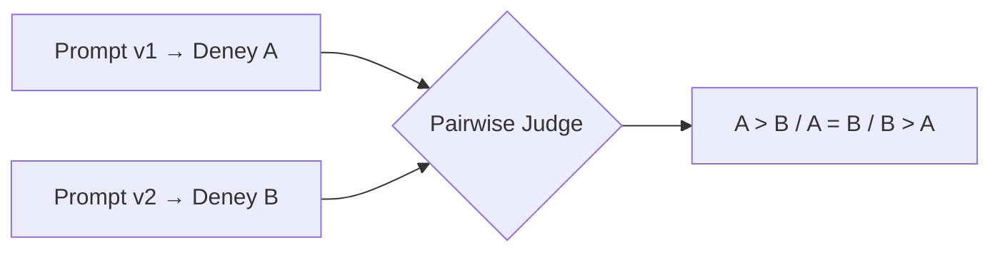

# LLM-as-judge Evaluator Yazma

<span class="badge badge-ileri">🔴 İLERİ / SENIOR</span>

[evaluate() ile Toplu Değerlendirme](evaluate-fonksiyonu.md)'deki `dogruluk_evaluator`, basit bir string eşleşmesiydi. Gerçek dünyada cevaplar serbest metin olduğunda ("evet, 14 gün içinde iade edebilirsiniz" ile "14 gün" aynı anlama gelir ama eşleşmez), bir **LLM'i yargıç olarak** kullanmanız gerekir — buna **LLM-as-judge** denir.

## Üç bileşen

1. **Evaluator fonksiyonu** — girdi/çıktıyı alıp bir LLM'e sorup skor döndürür
2. **Target fonksiyon** — değerlendirilen uygulamanın kendisi ([evaluate()](evaluate-fonksiyonu.md)'de gördüğümüz)
3. **Dataset ve evaluate()** — ikisini bir araya getiren çalıştırma

## Structured output ile güvenilir skorlama

```python
from langsmith import Client, wrappers
from openai import OpenAI
from pydantic import BaseModel

oai_client = wrappers.wrap_openai(OpenAI())

class Skor(BaseModel):
    dogru_mu: bool
    gerekce: str

def dogruluk_yargici(inputs: dict, outputs: dict, reference_outputs: dict) -> bool:
    """Bir LLM kullanarak cevabın anlamsal olarak doğru olup olmadığını değerlendirir."""
    talimat = """Verilen soru, beklenen cevap ve gerçek cevaba bakarak,
gerçek cevabın anlam olarak beklenen cevapla tutarlı olup olmadığını değerlendir."""

    mesaj = f"""Soru: {inputs['soru']}
Beklenen cevap: {reference_outputs['beklenen']}
Gerçek cevap: {outputs['cevap']}"""

    sonuc = oai_client.chat.completions.parse(
        model="gpt-4o-mini",
        messages=[{"role": "system", "content": talimat}, {"role": "user", "content": mesaj}],
        response_format=Skor,
    )
    return sonuc.choices[0].message.parsed.dogru_mu
```

`response_format=Skor` ile **structured output** kullanmak, yargıç modelin serbest metin yerine garanti bir `bool` döndürmesini sağlar — string ayrıştırmaya (regex, "evet" kelimesi arama) güvenmekten çok daha sağlamdır.

## Birden fazla boyutu tek evaluator'da değerlendirme

[LangGraph rehberindeki Ajan Değerlendirme](https://emineksknc.github.io/langgraph-turkce/ileri-seviye/degerlendirme/) sayfasında gördüğünüz 5 boyutu (correctness, tool selection, faithfulness, relevance, latency) ayrı evaluator'lar olarak yazıp `evaluate()`'e liste halinde verebilirsiniz:

```python
def faithfulness_yargici(inputs: dict, outputs: dict) -> float:
    """Cevabın verilen kaynağa ne kadar sadık kaldığını 0-1 arası puanlar."""
    ...

sonuclar = client.evaluate(
    hedef_fonksiyon,
    data="rag-test-seti",
    evaluators=[dogruluk_yargici, faithfulness_yargici],
)
```

Her evaluator, sonuç tablosunda **ayrı bir sütun** olarak görünür — hangi boyutta zayıf olduğunuzu ayırt edebilirsiniz.

## Hazır evaluator'lar

Her evaluator'ı sıfırdan yazmanıza gerek yok — LangSmith, yaygın senaryolar için (QA correctness, embedding benzerliği, kriter bazlı değerlendirme) hazır evaluator'lar sunar; bunları `langsmith.evaluation` modülünden veya OpenEvals kütüphanesinden içe aktarabilirsiniz.

## Pairwise Evaluation — iki versiyonu karşılaştırma

Şimdiye kadarki evaluator'lar **tek bir çıktıya** mutlak bir skor verdi. Bazen asıl soru mutlak değil **görecelidir**: "prompt v1 mi daha iyi, v2 mi?" Buna **pairwise evaluation** denir — yargıç modele iki cevabı birlikte gösterip hangisinin daha iyi olduğuna karar verdirirsiniz.



```python
def pairwise_yargic(inputs: dict, outputs_a: dict, outputs_b: dict) -> dict:
    """İki farklı deneyin çıktısını karşılaştırıp hangisinin daha iyi olduğuna karar verir."""
    talimat = "Aşağıdaki iki cevaptan hangisi soruyu daha iyi cevaplıyor? 'A', 'B' veya 'esit' döndür."
    mesaj = f"Soru: {inputs['soru']}\nCevap A: {outputs_a['cevap']}\nCevap B: {outputs_b['cevap']}"
    # LLM-as-judge çağrısı
    ...

client.evaluate(
    hedef_fonksiyon,
    data="test-seti",
    evaluators=[pairwise_yargic],
    # ...
)
```

Pairwise evaluation, özellikle **mutlak bir "doğru cevap" olmadığında** (yaratıcı yazım, üslup, genel cevap kalitesi) mutlak skorlamadan daha güvenilir sonuç verir — modelin "7/10 mu 8/10 mu" arasındaki farkı tutarlı ayırt etmesi zordur, ama "A mı B mi daha iyi" sorusunu çok daha tutarlı cevaplar.

**Tipik kullanım alanları:** prompt versiyonu karşılaştırma, model karşılaştırma (`gpt-4o-mini` vs `gpt-4o`), ajan versiyonu karşılaştırma, RAG pipeline karşılaştırma.

## Yargıç modelin kendi sınırlamaları

LLM-as-judge, insan değerlendirmesinin **yerine geçmez**, onu **ölçeklendirir**. Yargıç modelin kendisi de sistematik hatalar yapabilir:

| Sınırlama | Ne anlama gelir |
|---|---|
| **Position bias** | Pairwise değerlendirmede, yargıç model genelde **ilk gösterilen** cevabı sistematik olarak tercih eder — A/B sırasını rastgele değiştirmeden karşılaştırma yapmak yanıltıcı olabilir |
| **Verbosity bias** | Yargıç model, daha **uzun** cevapları (içerik kalitesi aynı olsa bile) daha iyi olarak değerlendirme eğilimindedir |
| **Self-preference** | Bir model ailesi (ör. GPT), kendi ailesinin ürettiği cevapları başka bir modelin (ör. Claude) ürettiği eşdeğer kalitedeki cevaba göre sistematik olarak daha yüksek puanlayabilir |
| **Inconsistent scoring** | Aynı girdi-çıktı çiftine, farklı çalıştırmalarda farklı skorlar verebilir (özellikle sürekli/1-10 skalalarda) |

!!! danger "Kalibrasyon şart"
    Kritik kararlar için (production'a çıkış onayı gibi) periyodik olarak yargıç modelin skorlarını birkaç **insan** örneğiyle karşılaştırıp (bkz. [Human Feedback](../ileri-seviye/feedback-annotation.md)) yargıcın kendisinin güvenilir olduğunu doğrulayın. Yargıcın insan değerlendirmesiyle sistematik olarak uyuşmadığı bir alan bulursanız (ör. hep daha uzun cevabı seçiyor), yargı talimatınızı buna göre revize edin.

---

Sıradaki adım: [RAG Evaluation](rag-evaluation.md) — RAG sistemlerine özel değerlendirme boyutlarını görelim.
