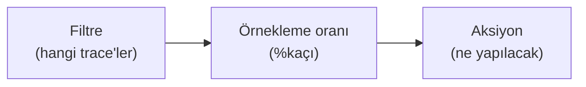

# Online Evaluation

<span class="badge badge-ileri">🔴 İLERİ / SENIOR</span>

[evaluate()](evaluate-fonksiyonu.md) sabit bir dataset üzerinde çalışır — **offline evaluation**. **Online evaluation**, gerçek production trafiği üzerinde, gerçek zamanlı olarak çalışan değerlendirmedir (bkz. [LangGraph rehberindeki Offline vs Online ayrımı](https://emineksknc.github.io/langgraph-turkce/ileri-seviye/degerlendirme/)).

## Automation Rules — online evaluation'ın temeli

Online evaluation, LangSmith'te **Automation Rules** (otomasyon kuralları) üzerinden UI'dan yapılandırılır. Bir kural üç şeyden oluşur:



- **Filtre**: hangi run'lar bu kurala girecek (ör. `tag:production`, `is:error`)
- **Örnekleme oranı**: trafiğin yüzde kaçının değerlendirileceği (tüm trafiği değerlendirmek maliyetlidir)
- **Aksiyon**: dataset'e ekleme, annotation queue'ya gönderme, webhook tetikleme, ya da doğrudan bir evaluator çalıştırma

## İki online evaluator türü

**1. LLM-as-judge (UI üzerinden yapılandırılır)**

Projenizde **Evaluators** sekmesinden bir LLM-as-judge kuralı ekleyip, [LLM-as-judge Evaluator Yazma](llm-as-judge.md)'da gördüğünüz gibi bir değerlendirme talimatı (ör. "bu cevap toksik mi?", "halüsinasyon var mı?") tanımlarsınız — LangSmith bunu örneklenen her run üzerinde otomatik çalıştırır.

**2. Custom Code (LangSmith içinde satır içi Python)**

```python
def perform_eval(run):
    """run: değerlendirilecek örneklenmiş run nesnesi"""
    cikti = run["outputs"]
    gecerli_mi = 1
    try:
        import json
        json.loads(json.dumps(cikti))  # çıktının geçerli JSON olduğunu doğrula
    except Exception:
        gecerli_mi = 0
    return {"format_gecerliligi": gecerli_mi}
```

Bu kod **LangSmith'in kendi sunucusunda** çalışır (harici ağ erişimi yoktur, sınırlı bir kütüphane setiyle) — karmaşık mantık için yerel `evaluate()` akışını tercih edin, custom code online evaluator'lar basit yapı/istatistik kontrolleri içindir.

## Tipik otomasyon senaryoları

| Senaryo | Filtre | Örnekleme | Aksiyon |
|---|---|---|---|
| Negatif geri bildirim alan her şeyi incele | `feedback.score < 0` | %100 | Annotation queue'ya ekle |
| Genel kalite spot-check | (yok) | %10 | LLM-as-judge çalıştır |
| Hataları arşivle | `is:error` | %100 | Extended retention + dataset'e ekle |

!!! warning "Maliyet ve veri saklama etkisi"
    Bir otomasyon kuralı eşleşen bir trace'i **extended data retention**'a (uzatılmış veri saklama) otomatik yükseltir — bu, trace fiyatlandırmasını etkiler. Yüksek trafikli projelerde örnekleme oranını dikkatli seçin; tüm trafiği %100 değerlendirmek hem maliyetli hem genelde gereksizdir.

---

Evaluation bölümü burada tamamlanıyor. Sıradaki bölüm: [Prompts — Prompt Hub](../prompts/prompt-hub.md).
