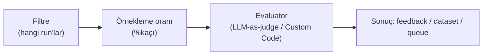

# Online Evaluation

<span class="badge badge-ileri">🔴 İLERİ / SENIOR</span>

[evaluate()](evaluate-fonksiyonu.md) sabit bir dataset üzerinde çalışır — **offline evaluation**. **Online evaluation**, gerçek production trafiği üzerinde, gerçek zamanlı olarak çalışan değerlendirmedir (bkz. [LangGraph rehberindeki Offline vs Online ayrımı](https://emineksknc.github.io/langgraph-turkce/ileri-seviye/degerlendirme/)).

## Online Evaluators — UI üzerinden yapılandırma

LangSmith'te online evaluation, bir tracing projesinin **Evaluators** sekmesinden eklenen **Online Evaluator**'lar ile yapılandırılır (UI: **Tracing Projects → [proje] → Evaluators → + Evaluator**):



- **Filtre**: hangi run'lar bu evaluator'a girecek (ör. `tag:production`, kullanıcı negatif feedback bıraktığında, belirli bir tool çağrıldığında)
- **Örnekleme oranı**: trafiğin yüzde kaçının değerlendirileceği (tüm trafiği değerlendirmek maliyetlidir)
- **Evaluator**: LLM-as-judge veya Custom Code (aşağıda)

!!! note "Automation Rules ile ilişkisi"
    Online evaluator'lar, arka planda **automation rule** altyapısını kullanır — bazı eski dokümanlarda/loglarda hâlâ "automation rule" terimini görebilirsiniz. Ama güncel LangSmith UI'ında ve dokümantasyonunda birincil terim **Online Evaluator**'dır; bu rehberde de o terimi kullanıyoruz.

## İki online evaluator türü

**1. LLM-as-judge**

[LLM-as-judge Evaluator Yazma](llm-as-judge.md)'da gördüğünüz gibi bir değerlendirme talimatı (ör. "bu cevap toksik mi?", "halüsinasyon var mı?") tanımlarsınız — LangSmith bunu örneklenen her run üzerinde otomatik çalıştırır. Sıfırdan yazabilir, mevcut bir evaluator'ı yeniden kullanabilir, ya da hazır bir şablondan başlayabilirsiniz.

**2. Custom Code (LangSmith içinde satır içi Python/JavaScript)**

```python
def perform_eval(run):
    """run: değerlendirilecek örneklenmiş run nesnesi"""
    cikti = run["outputs"]
    gecerli_mi = 1
    try:
        import json
        json.loads(json.dumps(cikti))  # çıktının geçerli JSON olduğunu doğrula
    except Exception:
        gecerli_mi = 0
    return {"format_gecerliligi": gecerli_mi}
```

Bu kod **LangSmith'in kendi sunucusunda** çalışır — internet erişimi yoktur, sadece standart kütüphane + `numpy`, `pandas`, `jsonschema`, `scipy`, `scikit-learn` gibi sınırlı bir paket seti kullanılabilir. Karmaşık mantık için yerel `evaluate()` akışını tercih edin; custom code online evaluator'lar basit yapı/istatistik kontrolleri içindir.

## Run-level vs Thread-level (multi-turn) evaluator

Şimdiye kadar gördüğümüz evaluator'lar **tek bir run'ı** değerlendirir. Çok turlu konuşmalarda ([Thread](../kavramlar/temel-terimler.md)) bazen "bu tek cevap iyi miydi?" değil, "**bu konuşmanın tamamı** iyi gitti mi?" sorusunu sormak istersiniz — buna **multi-turn (thread-level) online evaluator** denir. Kurulumu run-level ile aynıdır, sadece değerlendirme kapsamı tek run yerine tüm thread'tir.

## Tipik senaryolar

| Senaryo | Filtre | Örnekleme | Evaluator/Aksiyon |
|---|---|---|---|
| Negatif geri bildirim alan her şeyi incele | `feedback.score < 0` | %100 | Annotation queue'ya ekle |
| Genel kalite spot-check | (yok) | %10 | LLM-as-judge çalıştır |
| Hataları arşivle | `is:error` | %100 | Extended retention + dataset'e ekle |
| Konuşmanın genel tutarlılığı | Thread tamamlandığında | %20 | Thread-level LLM-as-judge |

!!! warning "Maliyet ve veri saklama etkisi"
    Bir online evaluator eşleşen bir trace'i **extended data retention**'a (uzatılmış veri saklama) otomatik yükseltir — bu, trace fiyatlandırmasını etkiler. Yüksek trafikli projelerde örnekleme oranını dikkatli seçin; tüm trafiği %100 değerlendirmek hem maliyetli hem genelde gereksizdir.

---

Evaluation bölümü burada tamamlanıyor. Sıradaki bölüm: [Prompts — Prompt Hub](../prompts/prompt-hub.md).
