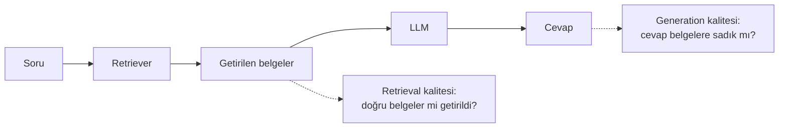

# RAG Evaluation

<span class="badge badge-ileri">🔴 İLERİ / SENIOR</span>

[LLM-as-judge](llm-as-judge.md)'de tek bir "doğru mu?" sorusu sorduk. Bir **RAG** (retrieval-augmented generation) sisteminde bu yeterli değildir — cevap yanlışsa, sorun **retrieval'da mı** (yanlış belge getirildi) yoksa **generation'da mı** (doğru belge getirildi ama model yanlış kullandı) olduğunu ayırt etmeniz gerekir.

## RAG'ın iki ayrı değerlendirme alanı



## Retrieval kalitesi

**Context relevance (bağlam alaka düzeyi)**: Getirilen belgeler soruyla gerçekten ilgili mi?

```python
def context_relevance_yargici(inputs: dict, outputs: dict) -> float:
    """Getirilen belgelerin soruyla alaka düzeyini 0-1 arası puanlar."""
    talimat = "Aşağıdaki belgelerin, verilen soruyla ne kadar alakalı olduğunu 0-1 arası puanla."
    mesaj = f"Soru: {inputs['soru']}\nBelgeler: {outputs['getirilen_belgeler']}"
    # LLM-as-judge çağrısı (bkz. LLM-as-judge Evaluator Yazma)
    ...
```

**Recall/Precision** (dataset'inizde "bu soru için ideal olarak şu belgeler getirilmeliydi" bilgisi varsa): getirilen belgelerin, beklenen belge kümesiyle ne kadar örtüştüğünü ölçer.

## Generation kalitesi

**Faithfulness / Groundedness (bağlılık)**: Cevap, **sadece** getirilen belgelerdeki bilgiye mi dayanıyor, yoksa model kendi bildiği (ve belgelerde olmayan) bir şey mi uydurdu (halüsinasyon)?

```python
def faithfulness_yargici(inputs: dict, outputs: dict) -> float:
    """Cevabın, verilen belgelere ne kadar sadık kaldığını puanlar."""
    talimat = """Cevabın, SADECE verilen belgelerdeki bilgiye dayanıp dayanmadığını değerlendir.
Belgelerde olmayan bir iddia varsa düşük puan ver."""
    mesaj = f"Belgeler: {outputs['getirilen_belgeler']}\nCevap: {outputs['cevap']}"
    ...
```

**Answer relevance (cevap alaka düzeyi)**: Cevap, belgelere sadık olsa bile, **gerçekten sorulan soruyu** cevaplıyor mu? (Faithfulness ile Answer relevance farklı şeylerdir — bir cevap belgelere tamamen sadık olup soruyla alakasız olabilir.)

**Answer correctness**: [evaluate()](evaluate-fonksiyonu.md)'de gördüğümüz klasik doğruluk kontrolü — cevap, beklenen cevapla anlam olarak örtüşüyor mu?

## Tek bir evaluate() çağrısında hepsini birleştirmek

```python
from langsmith import Client

client = Client()

sonuclar = client.evaluate(
    rag_hedef_fonksiyonu,
    data="rag-test-seti",
    evaluators=[
        context_relevance_yargici,
        faithfulness_yargici,
        answer_relevance_yargici,
        answer_correctness_yargici,
    ],
    experiment_prefix="rag-v2",
)
```

Sonuç tablosunda her boyut **ayrı bir sütun** olarak görünür — "cevap yanlıştı ama neden" sorusunun cevabını (düşük context relevance mi, düşük faithfulness mi) tek bakışta ayırt edersiniz.

## RAG dataset'inde nelere dikkat edilmeli

Genel [Dataset Oluşturma](dataset-olusturma.md)'daki tavsiyelere ek olarak, RAG dataset'lerinde şunları içermeniz önemlidir:

- **Cevaplanabilir sorular** — bilgi tabanınızda gerçekten karşılığı olan sorular
- **Cevaplanamaz sorular** — bilgi tabanınızda **olmayan** bir konuda soru; iyi bir RAG sistemi "bilmiyorum" demeli, uydurmamalı
- **Belirsiz/çok anlamlı sorular** — retriever'ın hangi belgeyi getireceğinin net olmadığı durumlar

!!! tip "Retrieval mi, generation mı hatalı — nasıl ayırt edersin?"
    Context relevance düşükse sorun **retriever**'dadır (embedding modeli, chunk boyutu, index kalitesi). Context relevance yüksek ama faithfulness düşükse sorun **prompt**'tadır (model, verilen bilgiyi doğru kullanmıyor). Bu ayrım, hangi bileşeni düzeltmeniz gerektiğini doğrudan söyler.

---

Sıradaki adım: [LangGraph Grafını Değerlendirme](langgraph-degerlendirme.md).
