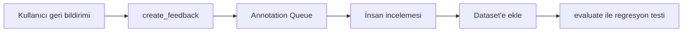

# Human Feedback & Annotation Queue

<span class="badge badge-ileri">🔴 İLERİ / SENIOR</span>

[LLM-as-judge](../evaluation/llm-as-judge.md) otomatik değerlendirmeyi ölçeklendirir, ama gerçek insan değerlendirmesinin yerini tam tutmaz. LangSmith, insan geri bildirimini yapılandırılmış şekilde toplamak için iki mekanizma sunar: **feedback** ve **annotation queue**.

## Feedback ekleme (programatik)

Kullanıcıdan gelen 👍/👎 gibi geri bildirimleri, ilgili run'a bağlamak için:

```python
from langsmith import Client

client = Client()

client.create_feedback(
    run_id=run_id,
    key="kullanici-begeni",
    score=1,  # 1 = beğenildi, 0 = beğenilmedi
    comment="Cevap doğru ve hızlıydı",
)
```

`run_id`'yi elde etmek için, `@traceable` fonksiyonunuzun çağrısını bir context manager içinde sararak run ID'sini yakalayabilirsiniz — ya da LangChain kullanıyorsanız `config={"run_id": ...}` ile kendi ürettiğiniz bir ID'yi baştan atayabilirsiniz.

## Feedback config — organizasyon çapında şema

Her ekip üyesinin aynı ölçütle geri bildirim vermesi için, feedback anahtarlarını önceden tanımlayabilirsiniz:

```python
# Sürekli (0-1 arası) skor
client.create_feedback_config(
    "dogruluk",
    feedback_config={"type": "continuous", "min": 0, "max": 1},
)

# Kategorik (Geçti/Kaldı gibi)
client.create_feedback_config(
    "sonuc",
    feedback_config={
        "type": "categorical",
        "categories": [{"value": 1, "label": "Geçti"}, {"value": 0, "label": "Kaldı"}],
    },
)
```

## Annotation Queue — insan gözden geçirme kuyruğu

**Annotation queue**, belirsiz veya düşük güvenli trace'leri otomatik olarak bir "gözden geçirme kuyruğuna" toplayan mekanizmadır — ekibiniz periyodik olarak bu kuyruğu inceleyip etiketler.

```python
kuyruk = client.create_annotation_queue(
    name="dusuk-guven-yanitlar",
    description="Modelin belirsiz olduğu ya da negatif feedback alan yanıtlar",
)
```

Kuyruğa run ekleme genelde [Online Evaluation](../evaluation/online-evaluation.md)'daki **automation rule**'lar üzerinden otomatik yapılır (ör. "negatif feedback alan her run'ı bu kuyruğa ekle"), ama programatik olarak da eklenebilir:

```python
client.add_runs_to_annotation_queue(queue_id=kuyruk.id, run_ids=[run_id_1, run_id_2])
```

## Feedback'i dataset'e dönüştürme

İnsan geri bildirimi biriktikçe, düşük skorlu örnekleri [Dataset Oluşturma](../evaluation/dataset-olusturma.md)'daki gibi bir test setine dönüştürüp regresyon testlerinize ekleyebilirsiniz — bu, [Observability vs Evaluation](../kavramlar/observability-vs-evaluation.md)'daki "pratik döngü"nün insan-geri-bildirimli versiyonudur.



---

Sıradaki adım: [CI/CD & Maliyet Takibi](cicd-maliyet.md).
