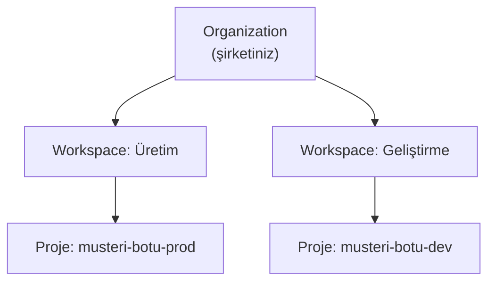
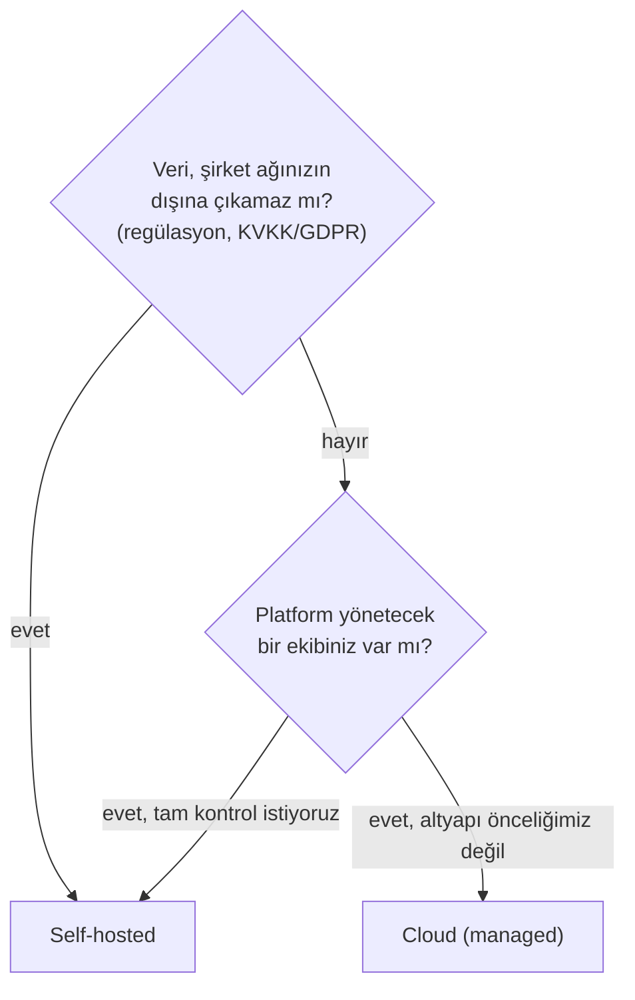

# Organizations, Erişim & Self-hosted Kararı

🔴 İLERİ / SENIOR

Bir ekipte LangSmith kullanmaya başladığınızda, tek kullanıcılı kurulumda karşılaşmadığınız sorular ortaya çıkar: kim hangi projeyi görebilir, API key'ler nasıl paylaşılır, verimiz nerede saklanmalı? Bu sayfa, **nasıl kurulacağını değil, hangi kararların verilmesi gerektiğini** kavram düzeyinde ele alıyor.

## Organizations & Workspaces

- **Organization**, faturalandırma ve üyelik seviyesindeki en üst birimdir — şirketinizi temsil eder.
- **Workspace**, bir organizasyon içinde izole edilmiş bir çalışma alanıdır — genelde takım (backend, ML) veya ortam (prod, dev) bazında ayrılır. Her workspace'in kendi projeleri, dataset'leri ve API key'leri vardır.
- **Proje**, [Metadata & Tag'ler](../tracing/metadata-taglar.md)'de gördüğünüz `LANGSMITH_PROJECT` ile eşleşen, trace'lerin gruplandığı birimdir.

!!! tip "Ne zaman ayrı workspace, ne zaman ayrı proje?"
    Farklı **ekipler** ya da tamamen farklı **erişim gereksinimleri** varsa (ör. bir müşteriye özel veri izolasyonu) ayrı workspace kullanın. Aynı ekip içinde farklı ortamlar (dev/staging/prod) için genelde aynı workspace'te ayrı proje adları yeterlidir — [Kurulum](../baslangic/kurulum.md)'da gösterilen `LANGSMITH_PROJECT` ile.

## Access Control temelleri

LangSmith, rol bazlı erişim kontrolü (RBAC) sunar — kimin ne yapabileceği roller üzerinden tanımlanır:

| Rol tipi | Tipik yetki |
|---|---|
| **Organization Admin** | Faturalandırma, workspace oluşturma/silme, üye yönetimi |
| **Workspace Admin** | O workspace'teki projeler, dataset'ler, API key'ler üzerinde tam yetki |
| **Member** | Trace görüntüleme, evaluation çalıştırma — genelde silme/yönetim yetkisi yok |
| **Read-only / Viewer** | Sadece görüntüleme — ör. bir paydaşa dashboard göstermek için |

**API key scope'ları**: Bir API key, ya **kullanıcı seviyesinde** (o kullanıcının tüm yetkileriyle) ya da **service account** seviyesinde (CI/CD gibi otomasyon için, belirli bir workspace'e sabitlenmiş) oluşturulabilir. [CI/CD](cicd-maliyet.md)'de kullandığınız key'in bir service account key'i olması, bir ekip üyesi işten ayrıldığında pipeline'ın bozulmamasını sağlar.

## Self-hosted vs Cloud — karar çerçevesi

| Kriter | Cloud | Self-hosted |
|---|---|---|
| Kurulum hızı | Dakikalar | Altyapı ekibi + zaman gerektirir |
| Veri konumu | LangChain Inc. sunucuları | Kendi altyapınız |
| Bakım yükü | Yok | Sizde (güncelleme, ölçekleme, yedekleme) |
| Regülasyon uyumu | Bölgesel veri saklama seçenekleri sınırlı olabilir | Tam kontrol |
| Maliyet yapısı | Kullanım bazlı abonelik | Altyapı + operasyon maliyeti |

!!! note "Bu rehberin kapsamı"
    Self-hosted'ın **nasıl kurulacağı** (Kubernetes, Docker Compose, Terraform) platform mühendisliğine ait, ayrı bir uzmanlık alanı — bu rehberin kapsamı dışında. Burada amaç, bir AI/ML mühendisinin "bu kararı kimle, hangi kriterlere göre konuşmam gerekiyor" sorusuna cevap vermek.

---

İleri / Production bölümü burada tamamlanıyor. Sıradaki bölüm: [Örnek Proje — LangGraph Botunu İzleme & Değerlendirme](../ornek-proje/langgraph-botu-izleme.md).
