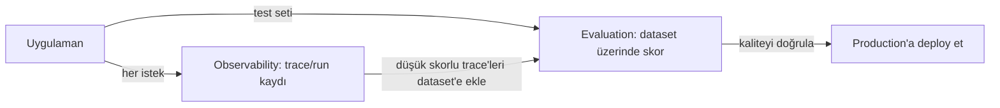

# Observability vs Evaluation

🟢 BAŞLANGIÇ

LangSmith'in iki ana yeteneği farklı sorulara cevap verir — ikisini karıştırmak, yanlış aracı yanlış anda kullanmaya yol açar.

| | Observability (İzlenebilirlik) | Evaluation (Değerlendirme) |
|---|---|---|
| Hangi soruyu cevaplar | "Üretimde şu an ne oluyor?" | "Bu değişiklik kaliteyi bozdu mu?" |
| Ne zaman kullanılır | Sürekli, production'da | Deploy öncesi (offline) veya örneklenmiş olarak sürekli (online) |
| Veri kaynağı | Gerçek kullanıcı trafiği | Sabit bir dataset veya örneklenmiş production trafiği |
| Temel birim | Trace, run | Experiment (deney), score |
| Tipik kullanım | Hata ayıklama, maliyet/gecikme izleme | "Prompt'u değiştirdim, doğruluk arttı mı azaldı mı?" |

## Neden ikisine de ihtiyacın var?

Sadece **observability** ile çalışırsan: üretimde bir şeylerin yanlış gittiğini görürsün ama "düzelttiğim şey gerçekten düzeldi mi?" sorusunu sistematik olarak cevaplayamazsın — her seferinde elle birkaç örnek deneyip "iyi görünüyor" demek zorunda kalırsın.

Sadece **evaluation** ile çalışırsan: dataset'in kapsamadığı gerçek dünya senaryolarını (kullanıcıların gerçekte ne sorduğunu) göremezsin — dataset'in zamanla eskiyip production'daki gerçek dağılımdan uzaklaşmasına (drift) kör kalırsın.

!!! tip "Pratik döngü"
    En sağlıklı akış: **observability**'den (production trace'lerinden) düşük skorlu veya ilginç örnekleri bulup **evaluation** dataset'ine eklemek, böylece dataset'in zamanla gerçek dünyaya daha çok benzemesini sağlamak. Bu döngü [LangGraph rehberindeki Offline/Online evaluation](https://emineksknc.github.io/langgraph-turkce/ileri-seviye/degerlendirme/) ayrımıyla birebir örtüşür — LangSmith bu ikisini de tek platformda sağlar.

---

Kavramlar bölümü burada tamamlanıyor. Sıradaki bölüm: [Tracing — Otomatik İzleme](../tracing/otomatik-izleme.md).
