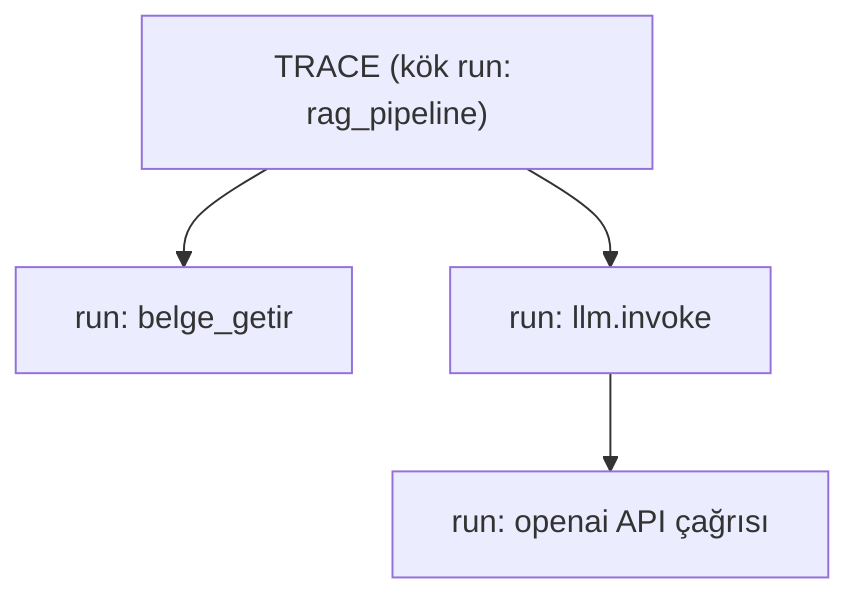
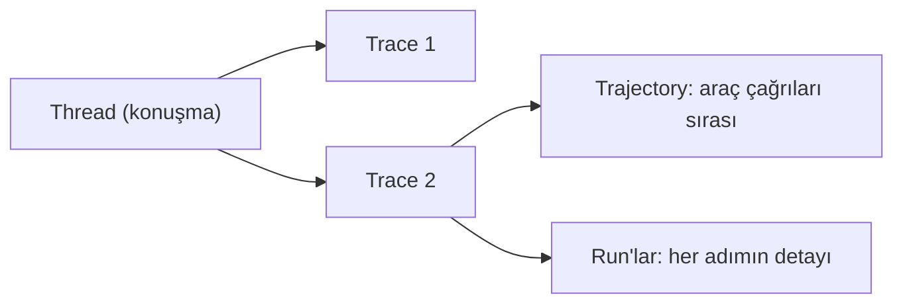

# Run, Trace, Thread, Trajectory

🟢 BAŞLANGIÇ

LangSmith'in veri modelini anlamadan filtreleme, dashboard ya da evaluation konularını takip etmek zorlaşır. Dört temel terim var.

## Run (çalıştırma)

**Run**, tek bir işlemin kaydıdır — bir LLM çağrısı, bir araç çalıştırması, ya da `@traceable` ile işaretlenmiş herhangi bir fonksiyon çağrısı. Her run'ın girdisi, çıktısı, başlangıç/bitiş zamanı ve (LLM run'larıysa) token/maliyet bilgisi vardır.

## Trace (iz)

**Trace**, bir isteğin **kök run'ından başlayan tüm run ağacıdır**. [İlk Trace](../baslangic/ilk-trace.md) sayfasındaki `rag_pipeline` → `belge_getir` örneğinde, `rag_pipeline` çağrısının tamamı (kendisi + içindeki tüm alt run'lar) tek bir trace'tir.

## Thread (iş parçacığı / konuşma dizisi)

**Thread**, birden fazla trace'i **tek bir konuşma** altında gruplayan kimliktir — [LangGraph'taki `thread_id`](https://emineksknc.github.io/langgraph-turkce/orta-seviye/checkpointer/) kavramıyla birebir aynı fikirdir. Bir kullanıcıyla 5 mesajlık bir konuşma, LangSmith'te aynı thread altında 5 ayrı trace olarak görünür — UI'da "bu konuşmanın tamamını göster" dediğinizde hepsini bir arada görürsünüz.

## Trajectory (izlence)

**Trajectory**, bir ajanın bir görevi tamamlarken izlediği **adım dizisidir** — hangi araçları hangi sırayla çağırdığı, hangi ara kararları verdiği. Evaluation bağlamında önemlidir: bazen sadece son cevap değil, **oraya nasıl ulaşıldığı** da değerlendirilmek istenir (bkz. [LLM-as-judge Evaluator Yazma](../evaluation/llm-as-judge.md)'daki tool selection değerlendirmesi).

## Bu terimler nasıl bir araya geliyor?

Bir müşteri destek konuşmasını örnek alırsak: **thread** = tüm konuşma, her kullanıcı mesajına verilen cevap ayrı bir **trace**, o trace içindeki her LLM/araç çağrısı bir **run**, ajanın o cevaba ulaşmak için izlediği yol ise **trajectory**'dir.

---

Sıradaki adım: [Observability vs Evaluation](observability-vs-evaluation.md) — ne zaman hangisini kullanacağını netleştirelim.
