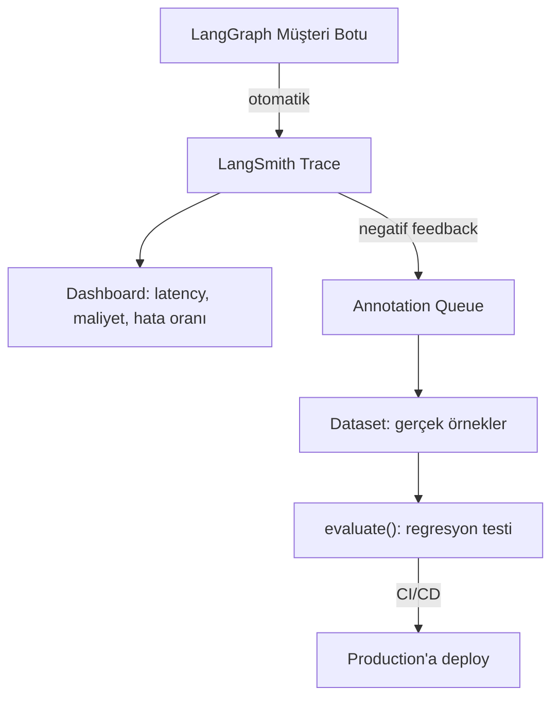

# Örnek Proje — LangGraph Botunu İzleme & Değerlendirme

<span class="badge badge-ileri">🔴 İLERİ / SENIOR</span>

Bu sayfada, [LangGraph rehberindeki müşteri destek botunu](https://emineksknc.github.io/langgraph-turkce/ornek-proje/musteri-destek-botu/) alıp bu rehberde öğrendiğimiz LangSmith tekniklerini uyguluyoruz: izleme, geri bildirim toplama, dataset oluşturma ve değerlendirme.

## Genel akış



## 1. İzlemeyi aktif etme — sıfır kod değişikliği

```python
import os

os.environ["LANGSMITH_TRACING"] = "true"
os.environ["LANGSMITH_PROJECT"] = "musteri-botu-prod"
# LANGSMITH_API_KEY zaten .env'de tanımlı

# LangGraph botunun geri kalanı hiç değişmiyor
app = builder.compile(checkpointer=checkpointer)
```

Bu üç satır sayesinde, [Örnek Proje](https://emineksknc.github.io/langgraph-turkce/ornek-proje/musteri-destek-botu/)'deki `router`, `chatbot`, `iade_kontrol`, `iade_isle` node'larının **her biri** ayrı bir run olarak, `thread_id` bazında gruplanmış trace'ler halinde otomatik görünür.

## 2. Metadata ile zenginleştirme

```python
def sohbet_endpoint(mesaj: str, kullanici_id: str, thread_id: str):
    config = {
        "configurable": {"thread_id": thread_id, "kullanici_id": kullanici_id},
        "metadata": {"kullanici_id": kullanici_id, "kanal": "web-widget"},
        "tags": ["production", "musteri-destek"],
    }
    return app.invoke({"messages": [("user", mesaj)]}, config)
```

## 3. Kullanıcı geri bildirimini bağlama

```python
from langsmith import Client

client = Client()

def geri_bildirim_kaydet(run_id: str, begenildi: bool):
    client.create_feedback(
        run_id=run_id,
        key="kullanici-begeni",
        score=1 if begenildi else 0,
    )
```

Frontend'de her cevabın altına 👍/👎 butonu koyup bu fonksiyonu çağırmak, [Human Feedback](../ileri-seviye/feedback-annotation.md)'de gördüğümüz döngüyü başlatır.

## 4. Production trace'lerinden dataset oluşturma

Birkaç hafta çalıştıktan sonra, negatif feedback alan konuşmaları bir test setine dönüştürün:

```python
dusuk_skorlu_runlar = client.list_runs(
    project_name="musteri-botu-prod",
    filter='and(eq(feedback_key, "kullanici-begeni"), eq(feedback_score, 0))',
    is_root=True,
)

dataset = client.create_dataset("musteri-botu-basarisiz-ornekler")
examples = [{"inputs": run.inputs, "outputs": run.outputs} for run in dusuk_skorlu_runlar]
client.create_examples(dataset_id=dataset.id, examples=examples)
```

## 5. Regresyon testi — router + iade akışını birlikte değerlendirme

```python
def hedef_fonksiyon(inputs: dict) -> dict:
    config = {"configurable": {"thread_id": f"eval-{hash(str(inputs))}"}}
    sonuc = app.invoke(inputs["messages_input"], config)
    return {"cevap": sonuc["messages"][-1].content}

def dogruluk_yargici(inputs: dict, outputs: dict, reference_outputs: dict) -> bool:
    # bkz. LLM-as-judge Evaluator Yazma
    ...

sonuclar = client.evaluate(
    hedef_fonksiyon,
    data="musteri-botu-basarisiz-ornekler",
    evaluators=[dogruluk_yargici],
    experiment_prefix="v3-duzeltme",
)
```

Bu, tam olarak "önce başarısız olan örnekleri gerçek dünyadan topla, sonra düzeltmenin işe yarayıp yaramadığını doğrula" döngüsüdür — [Observability vs Evaluation](../kavramlar/observability-vs-evaluation.md)'da anlatılan pratik döngünün uçtan uca uygulanmış hali.

## 6. CI/CD'ye bağlama

Bu regresyon testini [CI/CD & Maliyet Takibi](../ileri-seviye/cicd-maliyet.md)'de gösterilen `pytest` + GitHub Actions akışına ekleyerek, her yeni prompt/model değişikliğinin bu gerçek başarısızlık örnekleri üzerinde **hâlâ** doğru çalıştığını her PR'da otomatik doğrulayın.

---

📚 Bu örnek, iki rehberi birleştiriyor: [LangGraph Türkçe Rehberi](https://emineksknc.github.io/langgraph-turkce/) (botun kendisi) ve bu LangSmith rehberi (izleme ve değerlendirme). Takıldığın bir noktada [Sözlük](../sozluk.md)'e ya da [alıştırma sorularına](../alistirmalar/baslangic-sorulari.md) göz atabilirsin.
